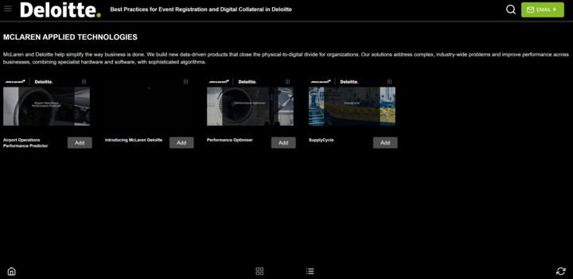
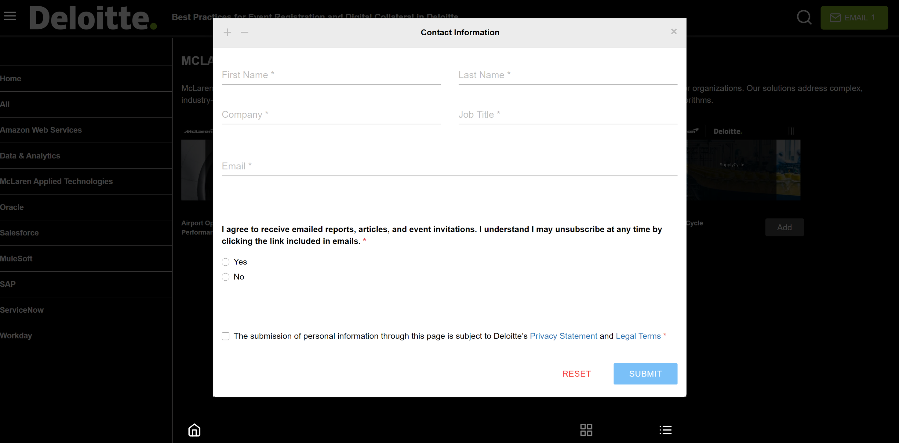
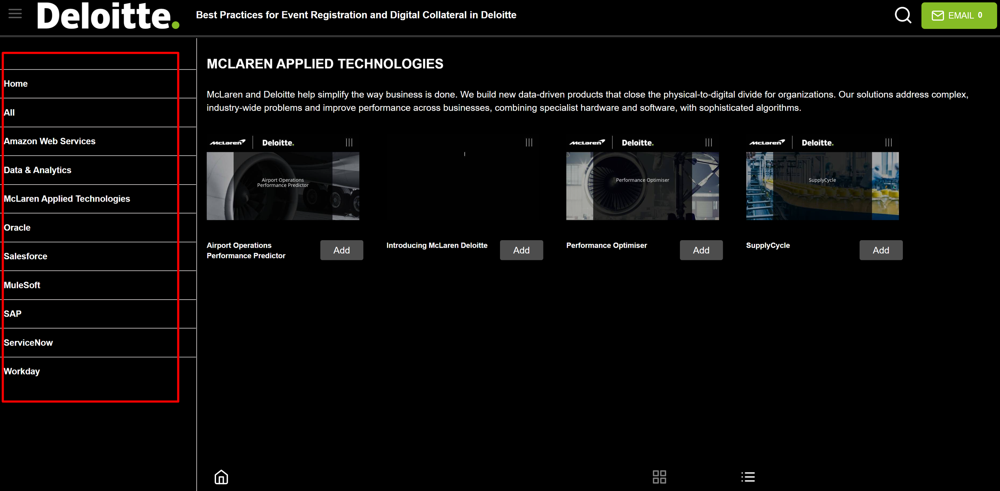

# Deloitte
### Description

_The page that displays the content library. The page contains several different types of files in the appropriate format. Categories are added to filter content.
Categories have a title and description that appear on the page when you select it and display the attached content.
Added a header that shows the company logo, event name, search bar, and email button.
The search bar searches content by name.
Added an email button that shows the fields that the user must fill in to submit the selected content._

### The following APIs were used

* ___

    * https://app.highattendance.com/get-comp-logo/2731

    * https://app.highattendance.com/get-app-fields/2731?eventId=2570

    * https://app.highattendance.com/content-app-cats/jVV3Q?appId=2731&eventId=2570

    * https://app.highattendance.com/content-thumbnail-url/2731

    * https://app.highattendance.com/contents/count-view/12554/2731/2570

### Used materials and libraries

* [HTML](https://html.com/)

* [CSS](https://css-tricks.com/)

* [JAVASCRIPT](https://learn.javascript.ru/)

* [REACT JS](https://reactjs.org/)

* [REACT ROUTER DOM](https://reactrouter.com/)

* [CLASSNAMES](https://www.npmjs.com/package/classnames)

* [PROP-TYPES](https://www.npmjs.com/package/prop-types)

* [FETCH API](https://developer.mozilla.org/en-US/docs/Web/API/Fetch_API)

___
## Part 1

## Part 2 

## Part 3

